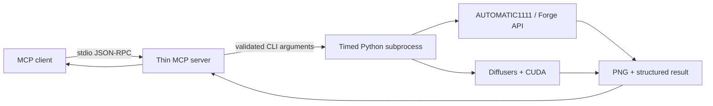

# Local GPU Imagegen MCP

Give MCP-compatible agents a focused, local-first image generation toolchain for AUTOMATIC1111/Forge WebUI and Hugging Face Diffusers.

> Pre-release status: the stdio protocol, schemas, structured errors, WebUI integration with mocks, and no-download safety policy are tested. A retained real-client generation demo is still pending.

## Why This Project

- **Local-first by default:** prompts and images stay on the configured machine when the WebUI URL is local.
- **No hidden model downloads:** Diffusers uses local files only unless `allow_download` is explicitly enabled.
- **Two practical backends:** reuse an existing AUTOMATIC1111-compatible API or run Diffusers directly.
- **Agent-readable results:** successful calls and failures include structured JSON, not only console text.
- **Dependency-light MCP layer:** protocol checks and tests use the Python standard library and require no GPU.
- **Focused scope:** image generation is kept separate from planning, memory, and unrelated agent features.

## Quick Start

### 1. Verify The MCP Server

Python 3.11 or 3.12 is enough for this check. No GPU, model, or AI client is required.

```powershell
python .\scripts\verify_mcp.py
```

Expected result:

```json
{
  "ok": true,
  "transport": "stdio",
  "python": "<current-python>",
  "server": {"name": "local-gpu-imagegen", "version": "0.2.0"},
  "protocolVersion": "2024-11-05",
  "tools": ["local_gpu_generate_image", "local_gpu_imagegen_check"]
}
```

### 2. Choose A Backend

| Backend | Best when | Setup | Network behavior |
|---|---|---|---|
| WebUI | AUTOMATIC1111 or Forge is already installed | Start it with API access enabled | Prompts/images go to the configured WebUI URL |
| Diffusers | You want a self-contained Python pipeline | Create the project `.venv` with `scripts/install.ps1` | Model/LoRA downloads are blocked unless explicitly allowed |

Check current readiness:

```powershell
python .\scripts\check_gpu.py
```

The command returns JSON. `ready: false` is a valid diagnostic state, not a protocol failure.

To verify the MCP server under a specific virtual environment and call readiness through MCP:

```powershell
python .\scripts\verify_mcp.py `
  --python .\.venv\Scripts\python.exe `
  --check-readiness
```

### 3. Connect An MCP Client

The bundled `.mcp.json` uses a relative command and `cwd`. For a client with global configuration, replace `<project-root>` with this clone's absolute path:

```json
{
  "mcpServers": {
    "local-gpu-imagegen": {
      "command": "python",
      "args": ["<project-root>\\scripts\\mcp_server.py"]
    }
  }
}
```

Restart the client, then call `local_gpu_imagegen_check` before the first generation.

## Tool Reference

### `local_gpu_imagegen_check`

Reports Python packages, CUDA devices, WebUI reachability, and aggregate readiness. A machine can be not ready while the tool call itself succeeds.

### `local_gpu_generate_image`

Supports:

- `txt2img`, `img2img`, and inpainting
- fixed seeds
- WebUI checkpoint and sampler selection
- Diffusers scheduler selection
- LoRA loading
- VAE tiling and optional CPU offload
- explicit CPU fallback
- explicit model/LoRA download permission

The tool schema validates types, ranges, enums, unknown fields, image-mode requirements, and dimensions before starting the backend process.

## Standalone Usage

Generate through an already-running WebUI:

```powershell
python .\scripts\generate_image.py `
  --backend webui `
  --prompt "a small robot reading a circuit diagram, clean concept art" `
  --width 1024 --height 1024 --seed 42
```

Create a project-local Diffusers environment:

```powershell
powershell -ExecutionPolicy Bypass -File .\scripts\install.ps1
```

Diffusers will not fetch missing model files by default. After reviewing the model license and storage requirement, opt in for a specific run:

```powershell
.\.venv\Scripts\python.exe .\scripts\generate_image.py `
  --backend diffusers `
  --model stabilityai/sd-turbo `
  --allow-download `
  --prompt "a compact lunar research station, technical concept art" `
  --seed 42
```

Generated files default to `outputs/`. Override this with `LOCAL_GPU_IMAGEGEN_OUTPUT_DIR` or `--output-dir`.

## Architecture



The transport layer owns JSON-RPC, schemas, validation, dispatch, timeouts, and structured results. Backend loading and image generation stay in `scripts/generate_image.py`.

See [Architecture](docs/architecture.md) for the detailed control flow and error model.

## Safety And Privacy

- The MCP process does not use an application-specific cloud image API.
- A non-loopback `webui_url` sends prompts and source images to that configured server. Use `127.0.0.1` for fully local WebUI operation.
- `scripts/install.ps1` downloads Python packages when the user runs it.
- Diffusers model and LoRA downloads require `--allow-download` or MCP `allow_download: true`.
- Disabling a model safety checker is explicit and off by default.
- Input images and generated files remain ordinary local files; protect their directories with OS permissions appropriate to their sensitivity.

See [Security](SECURITY.md) before exposing a WebUI API beyond localhost.

## Test

The suite requires no GPU and downloads no models:

```powershell
python -m unittest discover -s tests -v
python .\scripts\verify_mcp.py
```

Coverage includes protocol initialization/listing/ping, portable configuration launch, request-ID preservation, server-side schema validation, structured readiness/results, timeout errors, WebUI response decoding, malformed responses, and download policy.

## Project Status

Verified:

- stdio MCP initialization, tool listing, ping, and tool contract
- structured tool success/error results
- mocked WebUI success and failure paths
- local-only Diffusers hub policy by default
- CUDA readiness detection on the development machine

Pending before a `1.0` claim:

- retained real MCP-client request, JSON response, and generated PNG
- published compatibility matrix across named MCP clients
- measured performance or VRAM data

No production-readiness, model-training, custom diffusion-model, latency, or VRAM claim is made.

## Documentation

- [Architecture and error model](docs/architecture.md)
- [Troubleshooting](docs/troubleshooting.md)
- [Stable Diffusion integration notes](references/stable-diffusion-image-generation.md)
- [Contributing](CONTRIBUTING.md)
- [Changelog](CHANGELOG.md)

## License

No open-source license has been selected yet. Add an approved `LICENSE` file before public release; source availability alone does not grant reuse rights.
