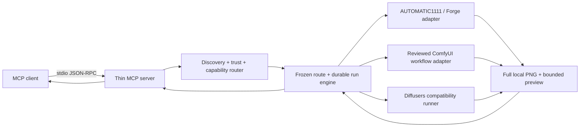

# Local GPU Imagegen MCP

An Agent-native local visual-asset control plane for existing AUTOMATIC1111/Forge, ComfyUI, and Diffusers installations. Describe the outcome in natural language; the Agent resolves one inspectable local model route, confirms it, and keeps generation/review/revision state durable.

> Version 0.5.0 is pre-release. Mocked/model-free tests cover the MCP contract, three visual Profiles, nine fixed briefs, three child revisions, discovery/routing, WebUI, and ComfyUI adapter contracts. Local Z-Image and Anima calls through the project adapter have been observed, but they do not prove visual quality and are not public 9+3 acceptance evidence. Real Codex/vision acceptance and Real-ESRGAN execution remain unverified; Codex and other clients are not verified hosts.

## Why This Project

- **Local-first by default:** prompts and images stay on the configured machine when the WebUI URL is local.
- **No hidden model downloads:** Diffusers uses local files only unless `allow_download` is explicitly enabled.
- **Three backend paths:** reuse AUTOMATIC1111/Forge or ComfyUI, or keep Diffusers as a compatibility path.
- **Agent-readable results:** successful calls and failures include structured JSON, not only console text.
- **Agent-guided workflow:** a bundled Agent Skill turns a natural-language brief into a catalog-gated, confirmed run.
- **Bring your existing models:** bounded discovery merges WebUI/Forge and ComfyUI inventory with explicit user-local trust; scanning never loads or downloads weights.
- **Frozen, explainable routing:** one model/backend/workflow/compiler identity is persisted and rechecked, with no silent model switch.
- **Durable review loop:** a persisted manifest tracks one to three successful generation rounds, evidence-based reviews, final selection, and recovery actions.
- **Three delivery Profiles:** standalone illustrations, presentation visuals, and UI visual assets share one deterministic run and review contract.
- **Auditable hot revision:** an immutable child run records a preserve/change contract and uses prompt refinement, img2img, or explicitly confirmed inpainting.
- **Anime profile data:** a versioned anime style and model registry make selection rules explicit without bundling a model.
- **Dependency-light MCP layer:** protocol checks and tests use the Python standard library and require no GPU.
- **Focused scope:** image generation is kept separate from planning, memory, and unrelated agent features.

## Quick Start

### 1. Verify The MCP Server

Python 3.11 or 3.12 is enough for this check. No GPU, model, or AI client is required.

```powershell
python .\scripts\verify_mcp.py
```

Expected result:

```json
{
  "ok": true,
  "transport": "stdio",
  "python": "<current-python>",
  "server": {"name": "local-gpu-imagegen", "version": "0.5.0"},
  "protocolVersion": "2024-11-05",
  "tools": [
    "local_gpu_branch_run",
    "local_gpu_cleanup_run",
    "local_gpu_confirm_mask",
    "local_gpu_discover_models",
    "local_gpu_finalize_run",
    "local_gpu_generate_image",
    "local_gpu_generate_round",
    "local_gpu_get_run",
    "local_gpu_imagegen_check",
    "local_gpu_list_profiles",
    "local_gpu_prepare_mask",
    "local_gpu_recommend_models",
    "local_gpu_record_review",
    "local_gpu_set_model_trust",
    "local_gpu_start_run"
  ]
}
```

### 2. Choose A Backend

| Backend | Best when | Setup | Network behavior |
|---|---|---|---|
| WebUI | AUTOMATIC1111 or Forge is already installed | Start it with API access enabled | Prompts/images go to the configured WebUI URL |
| ComfyUI | You already run ComfyUI and want reviewed graph execution | Set `LOCAL_GPU_IMAGEGEN_COMFYUI_URL`; use a shipped or validated imported workflow | Prompts/images go only to the confirmed endpoint |
| Diffusers | You want a self-contained Python pipeline | Create the project `.venv` with `scripts/install.ps1` | Model/LoRA downloads are blocked unless explicitly allowed |

Check current readiness:

```powershell
python .\scripts\check_gpu.py
```

The command returns JSON. `ready: false` is a valid diagnostic state, not a protocol failure.

To verify the MCP server under a specific virtual environment and call readiness through MCP:

```powershell
python .\scripts\verify_mcp.py `
  --python .\.venv\Scripts\python.exe `
  --check-readiness
```

### 3. Connect An MCP Client

The bundled `.mcp.json` uses a relative command and `cwd`. For a client with global configuration, replace `<project-root>` with this clone's absolute path:

```json
{
  "mcpServers": {
    "local-gpu-imagegen": {
      "command": "python",
      "args": ["<project-root>\\scripts\\mcp_server.py"]
    }
  }
}
```

Restart the client, then call `local_gpu_imagegen_check` before the first generation.

### 4. Ask For A Visual Asset

The bundled Agent Skill accepts ordinary requests. For example:

> Create a 16:9 standalone anime character illustration with no generated text. Use up to two successful rounds, keep downloads disabled, and ask before changing the seed.

The Skill will not guess from a checkpoint filename or silently select a backend. It discovers current local inventory, applies user-local trust, recommends one exact route, and waits for confirmation without downloading a model.

## Agent Skill Workflow

1. Call `local_gpu_discover_models` in `api_only` mode when inventory is unknown. Broader scans require a displayed plan and exact confirmation before filesystem access.
2. Use `local_gpu_set_model_trust` only after displaying one exact identity and receiving its exact trust confirmation. Private use and public evidence are separate scopes.
3. Call `local_gpu_list_profiles` for the intended authorization scope. Reuse known brief values and ask only for missing high-impact boundaries.
4. Call `local_gpu_recommend_models`. It returns one exact route and at most two alternatives without weakening hard requirements.
5. Display the exact resolved `model_choice`, backend, identity strength/hash or binding warning, workflow, compiler, dimensions, and budget. Wait for a new explicit confirmation after that display.
6. Start the frozen route and spend at most the confirmed successful-round budget. A retained image consumes a round; a backend failure does not.
7. On a vision-capable host, display and inspect the original full-resolution image. Record the required anatomy, feet/contact, hands/objects, and text/watermark checks with the full rubric; a preview alone is insufficient. Failed or uncertain checks require refine or explore. A refine preserves the seed; an explore changes the seed.
8. When an eligible review returns quality status `candidate`, display its limitations, image SHA-256, and exact `finalize:<run_id>:<round_number>:<image_sha256>` value, then stop. Only a later user message containing that displayed value may authorize finalization; the Agent cannot accept its own candidate.
9. On a text-only host, retain exactly one successful round, mark `review unavailable`, report the unreviewed path, and stop. Do not invent scores or call review/finalization tools.

After a reviewed or finalized candidate, the user can describe what to keep and what to change. The Skill presents an auditable preserve/change contract, asks for a separate one-to-three-round revision budget, and creates an immutable child run only after confirmation. It chooses the least destructive mode: same-seed prompt refinement, then low-strength img2img, then inpainting with explicit mask-overlay confirmation. No-mask preservation is best-effort.

The adaptive sequence is discovery -> trust when needed -> scoped catalog -> brief -> exact-route recommendation -> post-display confirmation -> start -> generate -> full-resolution inspect -> review -> refine/explore or display candidate -> wait for a later user message -> finalize. The configured `max_rounds` must be from `1` through `3`, and urgency or sunk cost never extends it.

### Visual Profiles And Scope

| Profile | Supported subtypes | Delivery focus |
|---|---|---|
| `standalone-illustration` | `character`, `environment`, `wallpaper` | Self-contained illustration output. |
| `presentation-visual` | `cover`, `section`, `content-background` | Visual-only slide assets with safe-area and overlay constraints. |
| `ui-visual-asset` | `hero`, `section-illustration`, `rectangular-background`, `decorative-texture` | Raster visuals that can be composed into an interface. |

Complete PPT decks are excluded. Frontend code and components are excluded. Production icons, SVG, and transparent PNG are excluded. Automatic segmentation is excluded. Seamless-texture guarantees are excluded. The project produces inspectable raster assets, not slide layouts or interface implementations.

### Bring Your Own Model Safely

Discovery has four levels: `api_only`, `selected_folders`, `common_locations`, and `full_drive`. Filesystem discovery is two-stage: `index` records bounded metadata without opening checkpoint payloads; `fingerprint` computes SHA-256 only for explicitly selected indexed candidates. `.ckpt` remains opaque, and scans do not follow symlinks, junctions, or reparse points.

Trust is stored outside the repository under the OS user-state directory, overridable with `LOCAL_GPU_IMAGEGEN_STATE_DIR`. A `backend_binding` identity can be trusted only for `private` use. A `cryptographic` identity may become a `public_evidence` candidate only with SHA-256, source, license, and output-redistribution metadata; acceptance authority is still required before export.

No model weights are bundled. The repository catalog includes the auditable ID `civitai/anything-v5@30163` for an already reviewed local WebUI checkpoint, and downloads remain unapproved. Other local models can enter the private catalog only through discovery and explicit trust; model quality still comes from the user's model. This project adds safer routing, durable review, and hot revision rather than claiming a superior prompt translator.

ComfyUI ships reviewed `sd15-txt2img-v1`, `z-image-turbo-txt2img-v1`, and `anima-txt2img-v1` workflow files. Discovery distinguishes `CheckpointLoaderSimple` from `UNETLoader`; the split-model templates pin their CLIP/text encoder, VAE, latent, sampling, and output nodes while binding only the confirmed primary model. A pure split-model installation may have no checkpoint choices. Shell, Python/script/process execution, network/download/webhook/fetch nodes, commands, unknown custom nodes, unbound parameters, and resource overruns are rejected.

The workflow files do not include, install, trust, or license model weights. Z-Image and Anima still require exact local discovery, user approval, and a confirmed route. Anima is an optional anime route and must not be presented as a commercial or public-evidence default under its upstream weight restrictions. ComfyUI adapter: contract-tested; local Z-Image and Anima adapter executions: observed; public acceptance evidence: not retained.

## Tool Reference

The public MCP surface has exactly fifteen tools: two compatibility tools and thirteen high-level discovery/run/revision tools.

### `local_gpu_imagegen_check`

Reports Python packages, CUDA devices, WebUI reachability, and aggregate readiness. A machine can be not ready while the tool call itself succeeds.

### `local_gpu_generate_image`

Supports:

- `txt2img`, `img2img`, and inpainting
- fixed seeds
- WebUI checkpoint and sampler selection
- Diffusers scheduler selection
- LoRA loading
- VAE tiling and optional CPU offload
- explicit CPU fallback
- explicit model/LoRA download permission

The tool schema validates types, ranges, enums, unknown fields, image-mode requirements, and dimensions before starting the backend process.

These two compatibility tools remain available beside the thirteen high-level tools. In particular, the low-level `local_gpu_generate_image` compatibility tool is unchanged: its optional model value remains a direct compatibility passthrough and is not the catalog-gated Agent workflow. Its WebUI/Diffusers options and explicit model-download controls are unchanged.

### High-Level Run Tools

| Tool | Responsibility |
|---|---|
| `local_gpu_discover_models` | Plan or execute bounded API/filesystem inventory without loading model weights. |
| `local_gpu_set_model_trust` | Approve or revoke one exact current identity in user-local state after confirmation. |
| `local_gpu_recommend_models` | Return one deterministic route and at most two explained alternatives. |
| `local_gpu_list_profiles` | List registered use-case profiles and the current backend capabilities. |
| `local_gpu_start_run` | Persist a confirmed intent, profile, constraints, backend choice, and round budget. |
| `local_gpu_get_run` | Read the durable manifest and its `recoverable_next_actions`. |
| `local_gpu_branch_run` | Create an immutable child run from one reviewed parent round and preserve/change contract. |
| `local_gpu_prepare_mask` | Prepare a user or rectangle/polygon mask and return a bounded JPEG overlay. |
| `local_gpu_confirm_mask` | Confirm an unchanged prepared mask after explicit user approval. |
| `local_gpu_generate_round` | Generate one root or fixed-mode child round and optionally return a bounded JPEG preview. |
| `local_gpu_record_review` | Store rubric scores, required structured visual checks, hard failures, constraint and preservation results, critique, and next action. |
| `local_gpu_finalize_run` | Verify the image-bound user confirmation and publish the nominated eligible round as the final local PNG. |
| `local_gpu_cleanup_run` | Remove intermediates or the entire confirmed run directory. |

`max_rounds` must be from `1` through `3`. Only successfully retained PNG rounds consume that budget; a backend failure is recorded as an attempt without consuming a round. Every new review requires `full_resolution_inspected: true`, whether a prominent human is present, and explicit observations for limb separation, feet/contact, hands/held objects, and text/watermarks. Human anatomy checks cannot be `not_applicable`; any required `fail` or `uncertain` result can request only refine or explore.

An eligible review exposes quality status `candidate`, never acceptance, and binds the run, round, and retained image SHA-256. The Agent displays the original image, limitations, hash, and exact `finalize:<run_id>:<round_number>:<image_sha256>`, then waits for a later user message. `local_gpu_finalize_run` requires that exact confirmation plus the nominated `round_number` and summary. It revalidates the candidate under the run lock, then publishes that nominated reviewed round without substituting a higher-scoring round; only the published result receives `accepted`.

An ineligible reviewed artifact is never published. Refine or explore while confirmed budget remains; otherwise retain it and request a new user decision without publication. Existing finalized manifests and the lower-level store compatibility path may still contain `needs_user_review`, but an unfinalized legacy review without structured visual checks cannot produce a public-engine candidate.

`local_gpu_list_profiles` returns the scoped merged catalog and current capabilities. `local_gpu_start_run` requires the exact `route_token`, authorization scope, model, backend, dimensions, workflow, and compiler that were displayed. Identity drift fails before backend invocation; root and child runs never switch routes silently.

### Run Files, Retry, And Recovery

The default durable layout is:

```text
outputs/
  runs/
    <run_id>/
      manifest.json
      parent-source.png
      round-01.png
      round-01-preview.jpg
      final.png
      final-upscaled.png
      masks/
        mask-01.png
        mask-01-overlay.jpg
```

`outputs/runs/<run_id>/manifest.json` is the source of truth for confirmed input, attempts, rounds, reviews, warnings, final metadata, and state revisions. A successful first round retains `round-01.png` and may create `round-01-preview.jpg`; later rounds use the same hyphenated preview pattern. Stored legacy manifests that reference `round-01.preview.jpg` remain readable and are not rewritten. Finalization publishes `final.png`. A preview file is optional: the MCP response may include the bounded JPEG preview, while `full_image_path` identifies the full-resolution local PNG. A preview warning or encoding failure does not discard the validated PNG.

An immutable child run copies the selected parent PNG to `parent-source.png`, records parent lineage and hashes, and never writes the parent manifest. Img2img and inpaint use that retained source. Inpaint additionally requires a confirmed `masks/mask-01.png`; `masks/mask-01-overlay.jpg` is returned for approval first. Changing source or mask bytes invalidates confirmation.

Each generation request needs an `idempotency_key`. Repeating the same key with the same request returns the completed round or reports that the attempt is busy; reusing the key for different inputs is rejected. After interruption, call `local_gpu_get_run` and follow `recoverable_next_actions`. The engine can reclaim stale attempts and resume preview creation when a validated full PNG was already retained.

Cleanup is explicit. For both `intermediates` and `all`, confirmation must exactly equal the `run_id`. The `intermediates` scope preserves the manifest and published final file; `all` removes the confirmed run directory.

### Optional Anime Real-ESRGAN Postprocess

Anime-only 4x postprocessing is explicit and local. Configure the tool root only with `LOCAL_GPU_IMAGEGEN_REALESRGAN_DIR`; the server accepts only `realesrgan-ncnn-vulkan.exe` plus one of the supported model pairs, `realesrgan-x4plus-anime` or `realesr-animevideov3-x4`, under that root. It accepts no arbitrary executable path or model name, and it does not download a binary or model.

No postprocessor runs automatically. Even `upscale_policy: auto` records permission only: the caller must pass the exact `postprocess` object to `local_gpu_finalize_run`, and the confirmed style must be `anime`. A successful request preserves the original `final.png`, returns `final-upscaled.png`, and records model, scale, source/output paths, hashes, dimensions, and MIME types in final postprocess metadata. Unavailable or failed postprocessing falls back to the original final with a structured warning. Real binary, GPU, quality, and performance behavior remains unverified.

## Standalone Usage

Generate through an already-running WebUI:

```powershell
python .\scripts\generate_image.py `
  --backend webui `
  --prompt "a small robot reading a circuit diagram, clean concept art" `
  --width 1024 --height 1024 --seed 42
```

Create a project-local Diffusers environment:

```powershell
powershell -ExecutionPolicy Bypass -File .\scripts\install.ps1
```

Diffusers will not fetch missing model files by default. After reviewing the model license and storage requirement, opt in for a specific run:

```powershell
.\.venv\Scripts\python.exe .\scripts\generate_image.py `
  --backend diffusers `
  --model stabilityai/sd-turbo `
  --allow-download `
  --prompt "a compact lunar research station, technical concept art" `
  --seed 42
```

Compatibility-tool files default to `outputs/`. Override this with `LOCAL_GPU_IMAGEGEN_OUTPUT_DIR` or `--output-dir`. High-level runs use the `runs/<run_id>/` layout under that output root.

## Architecture



The transport layer owns JSON-RPC, schemas, validation, dispatch, timeouts, and structured results. The run engine owns orchestration and delegates durable state to `RunStore`; backend loading and image generation stay in `scripts/generate_image.py`.

See [Architecture](docs/architecture.md) for the detailed control flow and error model.

## Safety And Privacy

- The MCP process does not use an application-specific cloud image API.
- A confirmed LAN WebUI/ComfyUI endpoint sends prompts and source images to that server. Loopback is local; each LAN endpoint requires exact transmission confirmation, and public internet endpoints are rejected.
- Discovery does not follow links or load checkpoint payloads. Broader filesystem scans require an unchanged, unexpired plan and exact confirmation.
- Trust state stays outside Git. Private trust never authorizes public evidence, and credentials are rejected recursively.
- `scripts/install.ps1` downloads Python packages when the user runs it.
- Diffusers model and LoRA downloads require `--allow-download` or MCP `allow_download: true`.
- Disabling a model safety checker is explicit and off by default.
- Input images and generated files remain ordinary local files; protect their directories with OS permissions appropriate to their sensitivity.

See [Security](SECURITY.md) before exposing a WebUI API beyond localhost.

## Test

The suite requires no GPU and downloads no models:

```powershell
python -m unittest discover -s tests -v
python .\scripts\verify_mcp.py
```

Coverage includes protocol initialization/listing/ping, the exact fifteen-tool contract, bounded discovery/trust/routing, WebUI and ComfyUI adapter contracts, durable root/child transitions, mask confirmation, idempotency, stale-attempt recovery, atomic publication, bounded preview handling, the mocked/model-free anime loop, all nine fixed briefs and three child revisions, fake-runner postprocessing, and download policy.

## Project Status

Verified:

- stdio MCP initialization, tool listing, ping, and tool contract
- structured tool success/error results
- thirteen high-level discovery/run/revision tools and two compatibility tools under mocked/model-free coverage
- adaptive Agent Skill briefing, exact-model confirmation, successful-round budgeting, and honest text-only stopping policy
- exact local-model identity, user-local trust, deterministic route, and drift-rejection contracts
- explicit anime-only Real-ESRGAN adapter behavior under fake-runner tests
- contract-tested WebUI and ComfyUI adapter success/failure paths
- durable manifest transitions, idempotency, recovery, review, finalization, and cleanup contracts
- three Profile contracts plus immutable preserve/change child runs and confirmed geometry/user masks
- a fake-backend contract matrix covering nine fixed briefs and three child revisions
- local-only Diffusers hub policy by default

Pending before a `1.0` claim:

- a complete retained 9+3 real host/vision acceptance matrix
- real ComfyUI integration evidence and reviewed output
- real Real-ESRGAN binary/GPU execution evidence
- published compatibility matrix across named MCP clients
- measured performance or VRAM data

The mocked/model-free matrix is deterministic protocol evidence, not retained real Codex/vision/GPU evidence. It exercises nine fixed briefs and three child revisions with a fake backend; it does not prove visual quality. The test suite does not load a production model, GPU backend, or Real-ESRGAN binary. No real-generation, production, performance, VRAM, image-quality, named-client compatibility, star, or popularity claim is made.

The current branch retains no complete real 9+3 image-acceptance matrix, no real ComfyUI generation result, and no image-quality, performance, or VRAM claim. Use the readiness commands above to inspect the target environment.

## Documentation

- [Architecture and error model](docs/architecture.md)
- [Troubleshooting](docs/troubleshooting.md)
- [Stable Diffusion integration notes](references/stable-diffusion-image-generation.md)
- [Contributing](CONTRIBUTING.md)
- [Changelog](CHANGELOG.md)

## License

No open-source license has been selected yet. Add an approved `LICENSE` file before public release; source availability alone does not grant reuse rights.
