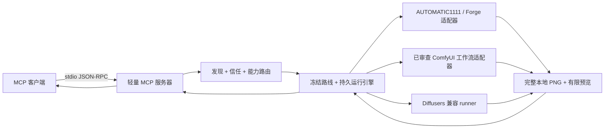

# Local GPU Imagegen

**简体中文** | [English](README.md)

> 这是 README 的中文本地化版本。命令、版本、工具名称、安全边界和证据边界
> 与英文原件保持一致；英文原件仍是逐项技术细节的权威文本。

Local GPU Imagegen 是一个 MCP 优先的控制层，为你已经在使用的 ComfyUI 环境增加
加密模型身份、明确批准和持久运行证据。

无需修改现有 ComfyUI 配置，即可从 Codex 运行受支持的工作流：

```shell
uvx local-gpu-imagegen verify
uvx local-gpu-imagegen setup codex --apply
```

v0.9 的受支持主机范围是 Windows 10/11 x64 与 NVIDIA。项目仍发布一个纯 Python
的 `py3-none-any` wheel；这不代表另有 Linux 版本，也不代表支持 Linux 托管生图。
Ubuntu CI 只验证平台中立的 MCP、打包、已有后端与不支持平台安全退出合同；Windows
运行完整 portable bootstrap 套件。

setup 会保存一个已经解析、固定当前版本的启动器，等价命令为
`uvx --from local-gpu-imagegen==0.9.0 local-gpu-imagegen serve`；它不依赖临时
`uvx` 环境中的控制台脚本。如果旧条目报告 `client_setup_drift`，请只移除对应客户端
条目，再重新应用 setup。启动 ComfyUI 不能修复 MCP 启动器故障；客户端成功加载
服务器后，才进入后端就绪检查。

然后向 Codex 提出：

```text
Run this supported ComfyUI API workflow from Codex: <path>.
Use this prompt: <prompt>. Preserve every other workflow setting.
```

这条路径要求 Python 3.11 或 3.12、Codex、已经安装的本地 ComfyUI、已经安装的模型，
以及一个采用受支持内置拓扑的普通 `txt2img` API 工作流。默认情况下 ComfyUI 仍需提前
运行。在 Windows 上，也可以在 setup 时显式指定一个已有 portable 根目录，让 MCP 托管
启动：

```powershell
uvx local-gpu-imagegen setup codex --apply `
  --auto-start-comfyui `
  --comfyui-root "<ComfyUI_windows_portable>"
```

这项 opt-in 功能会验证固定 portable 布局，并且只在 `127.0.0.1:8188` 上注册
`python_embeded\python.exe -s ComfyUI\main.py`。它不会安装 ComfyUI，也不会下载模型。
若端点已经运行，程序只复用它，不取得所有权，也不会停止它。由 MCP 创建的子进程只会在
MCP 退出且队列为空时停止；队列非空时会保留进程并报告状态。两种模式都不会静默下载或
切换模型，工作流执行仍限于受支持的内置拓扑。托管启动不会删除或管理所选 portable
安装中已经存在的 custom nodes。

ComfyUI 负责生成像素；Local GPU Imagegen 负责围绕生成建立权限、可复现性、审查和
恢复控制。

[五分钟快速开始](docs/quickstart.zh-CN.md) |
[Five-minute Quickstart](docs/quickstart.md)

## 使用你自己的 ComfyUI 工作流

保留的 Codex 工作流接入会话检查并注册了一个受支持的图，随后绑定其精确模型组件；
该会话没有提交提示词，也没有使用 GPU。英文公开 README 中的灯塔图像来自另一次
独立的 Codex 普通路线生成。这两项是不同的证据记录，都不能证明图像质量优越性。


普通 `sdxl-txt2img` 最终 1024x1024 PNG 的 SHA-256 为
`36b5de509a2da8c75571aac436d45d8a31a7a8efc77439abee9e0918191572f4`。
路线、提示词、参数、审查、客户端绑定、权利和限制记录在英文仓库的 showcase
manifest 中。

该路径要求已有本地图像后端和模型，不会静默下载或切换模型。

不带 `--apply` 的 `setup` 是只读操作。应用配置时，程序委托给客户端官方的
`mcp add` 命令；Local GPU Imagegen 不会直接编辑客户端配置文件，也不会下载模型。

**可信证据边界：**保留的普通路线结果来自一次已安装 Codex 会话。发现过程没有加载
权重；信任和路线身份是明确的；成功轮次有上限；审查使用原始分辨率 PNG；最终确定
绑定到已审查字节；运行状态仍可恢复。该证据只证明这一项结果，不证明完整 9+3 验收、
测量性能或生产就绪。

对于 Claude Code，使用：

```shell
uvx local-gpu-imagegen setup claude-code --apply
```

移除条目：

```shell
codex mcp remove local-gpu-imagegen
claude mcp remove --scope user local-gpu-imagegen
```

使用 `uvx local-gpu-imagegen doctor` 检查本地后端就绪状态。setup 合约和等价 stdio
启动已经验证；目前保留了一次 Codex 已安装客户端生成，而 Claude Code 生成仍待验证。

PyPI 发布前，请安装已验证 wheel 或使用源码检出，然后运行等价的
`local-gpu-imagegen verify` 和 `local-gpu-imagegen setup ...` 命令。

## 为什么需要这个项目

- **从 Agent 运行受支持的工作流：**检查和注册普通 ComfyUI API 图，而不是把它们
  重写成一次性脚本。
- **复用或显式托管后端：**ComfyUI 是现有工作流的主要路径；可选的 Windows portable
  supervisor 可以免去手动启动，同时不会接管已经运行的进程。AUTOMATIC1111/Forge 和
  Diffusers 保留为兼容路径。
- **让运行可复现：**将工作流、模型身份、提示词、参数、种子、预算和输出哈希冻结在
  持久 manifest 中。
- **使用已安装 CLI：**无需源码检出即可验证就绪状态，并委托给 Codex 或 Claude Code
  的官方配置命令。
- **明确模型权限：**发现永远不加载权重，生成不能静默下载或切换模型。
- **保留结构化证据：**路线、预算、尝试、图像哈希、审查和恢复操作均保持机器可读。
- **由用户决定接受：**原始分辨率审查和之后绑定字节的最终确定，将“生成图像”和
  “接受成品”分开。
- **Agent 引导工作流：**附带的 Agent Skill 把自然语言需求转换成目录约束且经过确认
  的运行。
- **三种交付 Profile：**独立插画、演示视觉素材和 UI 视觉资产共享确定性的运行与
  审查合约。
- **可审计热修订：**不可变子运行记录保留/修改合约，并使用提示词微调、img2img 或
  经过明确确认的 inpainting。
- **轻依赖 MCP 层：**协议检查和测试使用 Python 标准库，不需要 GPU。
- **范围专注：**图像生成与规划、记忆及其他无关 Agent 功能分离。

### 实验性构图控制

黄金路径使用普通 `sdxl-txt2img`。`sdxl-regional-txt2img` 和
`sdxl-two-stage-copy-subject` 仍为实验路线，不属于黄金路径，也不会作为普通路线的
回退。保留的负面证据不能证明它们改善了视觉质量。

### 图像质量边界

模型和工作流质量由用户提供。Local GPU Imagegen 增加明确执行、审查、恢复和证据，
不修改扩散算法，也不保证提示词工作流会改善图像。当输出改变了要求的产品媒介、主体、
实际用途或资产槽位时，即使替代品看起来更干净，审查仍将其视为语义替换和约束失败。

冻结的工作流无回归门最终为 `FAIL_WORKFLOW_REGRESSION`，因此不支持任何公开的图像
质量优越性主张。

## 源码检出与后端配置

### 1. 验证 MCP 服务器

该检查只需要 Python 3.11 或 3.12，不需要 GPU、模型或 AI 客户端。

```powershell
python .\scripts\verify_mcp.py
```

预期 JSON 包含：`ok: true`、服务器版本 `0.9.0`、协议 `2024-11-05`，以及以下
恰好 17 个工具：

```text
local_gpu_branch_run
local_gpu_cleanup_run
local_gpu_confirm_mask
local_gpu_discover_models
local_gpu_finalize_run
local_gpu_generate_image
local_gpu_generate_round
local_gpu_get_run
local_gpu_imagegen_check
local_gpu_inspect_workflow
local_gpu_list_profiles
local_gpu_prepare_mask
local_gpu_recommend_models
local_gpu_record_review
local_gpu_register_workflow
local_gpu_set_model_trust
local_gpu_start_run
```

### 2. 选择后端

| 后端 | 适用场景 | 配置 | 网络行为 |
|---|---|---|---|
| WebUI | 已安装 AUTOMATIC1111 或 Forge | 启动时启用 API | 提示词/图像发送到配置的 WebUI URL |
| ComfyUI | 已使用 ComfyUI，希望执行经过审查的图 | 自行启动，或对一个已有 Windows portable 安装显式使用 `setup --auto-start-comfyui --comfyui-root <root>` | 提示词/图像只发送到 loopback 或另行确认的端点 |
| Diffusers | 希望使用独立 Python pipeline | 用 `scripts/install.ps1` 创建项目 `.venv` | 除非明确允许，否则阻止模型/LoRA 下载 |

检查当前就绪状态：

```powershell
python .\scripts\check_gpu.py
```

该命令返回 JSON。`ready: false` 是有效诊断状态，不是协议失败。

托管启动必须显式开启，并且只支持 Windows portable。它强制使用 Python `-s` 隔离，
避免用户 site 中的 Torch 包污染 portable 运行时；启动在后台进行，不阻塞 MCP 初始化；
首次托管 readiness 检查会在配置的启动超时内等待。`doctor` 本身仍是只读命令，永远不会
启动后端。

在指定虚拟环境下验证 MCP，并通过 MCP 调用就绪检查：

```powershell
python .\scripts\verify_mcp.py `
  --python .\.venv\Scripts\python.exe `
  --check-readiness
```

### 3. 连接 MCP 客户端

附带的 `.mcp.json` 使用相对命令和 `cwd`。对于全局配置客户端，请把
`<project-root>` 替换为检出的绝对路径：

```json
{
  "mcpServers": {
    "local-gpu-imagegen": {
      "command": "python",
      "args": ["<project-root>\\scripts\\mcp_server.py"]
    }
  }
}
```

重启客户端，并在首次生成前调用 `local_gpu_imagegen_check`。

### 4. 请求视觉资产

附带的 Agent Skill 接受普通请求。例如：

> 创建一张 16:9 独立动漫角色插画，不要生成文字。最多使用两个成功轮次，保持下载
> 禁用，并在更改种子前询问我。

Skill 不会根据 checkpoint 文件名猜测，也不会静默选择后端。它会发现当前本地清单、
应用用户本地信任、推荐一条确切路线，并在不下载模型的情况下等待确认。

## Agent Skill 工作流

1. 清单未知时，以 `api_only` 模式调用 `local_gpu_discover_models`。更广扫描必须先
   展示计划，并在访问文件系统前获得精确确认。
2. 只有展示一个精确身份并收到对应信任确认后，才能调用
   `local_gpu_set_model_trust`。私有使用和公开证据是不同权限范围。
3. 针对预期授权范围调用 `local_gpu_list_profiles`。复用已知需求值，只询问缺失且影响
   较大的边界。
4. 调用 `local_gpu_recommend_models`。它返回一条精确路线和最多两个有解释的替代项，
   不会削弱硬性要求。
5. 展示解析后的 `model_choice`、后端、身份强度/哈希或绑定警告、工作流、编译器、
   尺寸和预算。展示后等待新的明确确认。
6. 启动冻结路线，读取持久冻结运行，构造完整生成计划，并且最多消耗确认的成功轮次
   预算。添加提示词和参数前，从运行中复制所有路线、身份、工作流、编译器、策略和
   预算字段。保留图像消耗一轮，后端失败不消耗。
7. 在支持视觉的宿主中展示并检查原始全分辨率图像。按完整 rubric 记录人体结构、
   脚/接触、手/物体和文字/水印检查；只看预览不够。失败或不确定时只能 refine 或
   explore。refine 保留种子，explore 更换种子。
8. 当合格审查返回 `candidate` 时，展示限制、图像 SHA-256 和精确的
   `finalize:<run_id>:<round_number>:<image_sha256>`，然后停止。只有之后的用户消息
   包含该值，才可授权最终确定；Agent 不能接受自己的候选。
9. 在纯文本宿主中，只保留一个成功轮次，标记 `review unavailable`，报告未审查路径并
   停止。不得编造评分或调用审查/最终确定工具。

审查后，用户可以描述要保留和修改的内容。Skill 会展示可审计的保留/修改合约，询问
独立的一至三轮修订预算，并仅在确认后创建不可变子运行。它选择破坏性最小的方式：
同种子提示词微调、低强度 img2img、最后才是需要明确蒙版覆盖确认的 inpainting。
没有蒙版时，保留只是尽力而为。

`copy-subject-v1` 和 `sdxl-two-stage-copy-subject` 都是可选实验路线。它们必须在确认
前展示完整区域、提示词、强度、工作流/组件摘要、种子和预算。能力不可用或发生漂移时
不得回退到普通提示词路线。两阶段路线的一轮会消耗两个 stage unit，并保留 base、
mask 和 final 三个角色绑定 PNG；任何部分结果都必须停止且不回退。

自适应顺序为：发现 -> 必要时信任 -> 有范围目录 -> 需求 -> 精确路线推荐 -> 展示后
确认 -> 启动 -> 读取持久运行 -> 构造完整计划 -> 生成 -> 全分辨率检查 -> 审查 ->
refine/explore 或展示候选 -> 等待之后的用户消息 -> 最终确定。`max_rounds` 必须在
`1` 至 `3` 之间，紧迫性或沉没成本都不能扩展预算。

### 视觉 Profile 与范围

| Profile | 支持的子类型 | 交付重点 |
|---|---|---|
| `standalone-illustration` | `character`、`environment`、`wallpaper` | 独立插画输出 |
| `presentation-visual` | `cover`、`section`、`content-background` | 带安全区和叠加约束的纯视觉幻灯片素材 |
| `ui-visual-asset` | `hero`、`section-illustration`、`rectangular-background`、`decorative-texture` | 可组合进界面的栅格视觉素材 |

完整 PPT、前端代码和组件、生产图标、SVG、透明 PNG、自动分割和无缝纹理保证均不在
范围内。项目生成可检查的栅格素材，不生成幻灯片布局或界面实现。

### 安全使用自有模型

发现分为 `api_only`、`selected_folders`、`common_locations` 和 `full_drive` 四级。
文件系统发现采用两阶段：`index` 只记录有限元数据，不打开 checkpoint payload；
`fingerprint` 只对明确选中的已索引候选计算 SHA-256。`.ckpt` 保持不透明，扫描不会
跟随符号链接、junction 或 reparse point。

信任存储在仓库外的操作系统用户状态目录，可用 `LOCAL_GPU_IMAGEGEN_STATE_DIR`
覆盖。`backend_binding` 身份只能信任为 `private`。拆分 ComfyUI 路线会先提供不变更
状态的检查，把主模型、文本编码器、VAE 和已审查工作流绑定为一个规范 SHA-256 bundle。
只有每个组件都具备确切来源、许可证和输出再分发元数据，并由接受权限批准同一 bundle，
它才可能成为 `public_evidence` 候选。

### 安全接入工作流

普通 `txt2img` 的 ComfyUI API 格式工作流可以在调用方不提供节点 ID 的情况下检查和
注册，支持单 checkpoint 或拆分模型拓扑：

```text
API-only discovery (when current inventory is absent)
-> local_gpu_inspect_workflow
-> display hashes, inferred binding, components, limitations, confirmation
-> later exact user confirmation
-> local_gpu_register_workflow
-> separate local_gpu_set_model_trust with registered_workflow_id
```

检查只读取一个明确的本地 JSON 文件，接受裸 API 图或唯一 `prompt` wrapper，并报告
`source_sha256`、`workflow_sha256`、拓扑、推断绑定、所属输出和组件身份。UI 格式不会
转换；注册不会授予模型信任或公开权限。保留了真实零 GPU 客户端接入证据，但生成证据
仍是独立记录。

仓库不包含模型权重。其他本地模型只能通过发现和明确信任进入私有目录；模型质量仍由
用户模型决定。工作流文件不会包含、安装、信任或许可模型权重。Z-Image 与 Anima 仍
需要精确本地发现、用户批准和确认路线；在上游权重限制下，Anima 不能作为商业或公开
证据默认项。

## 工具参考

公开 MCP 表面恰好有 17 个工具：两个兼容工具，以及 15 个高级发现、接入、运行和
修订工具。

### 兼容工具

- `local_gpu_imagegen_check`：报告 Python 包、CUDA 设备、WebUI 可达性和总体就绪
  状态。机器可以未就绪，但工具调用本身仍成功。
- `local_gpu_generate_image`：支持 `txt2img`、`img2img`、inpainting、固定种子、
  WebUI checkpoint/sampler、Diffusers scheduler、LoRA、VAE tiling、可选 CPU
  offload、明确 CPU 回退及明确模型/LoRA 下载权限。它是低级兼容 passthrough，不是
  目录约束的 Agent 工作流。

### 高级运行工具

| 工具 | 职责 |
|---|---|
| `local_gpu_discover_models` | 在不加载权重的情况下规划或执行有限 API/文件系统清单 |
| `local_gpu_inspect_workflow` | 检查普通 ComfyUI API `txt2img` 工作流并返回诊断或可注册哈希/绑定 |
| `local_gpu_register_workflow` | 在之后的摘要绑定确认后，复核精确提案并保存不可变工作流副本 |
| `local_gpu_set_model_trust` | 无变更检查组件 bundle，或在确认后批准/撤销一个用户本地身份 |
| `local_gpu_recommend_models` | 返回一条确定路线和最多两个有解释的替代项 |
| `local_gpu_list_profiles` | 列出注册的用途 Profile 和当前后端能力 |
| `local_gpu_start_run` | 持久化确认的意图、Profile、约束、后端和轮次预算 |
| `local_gpu_get_run` | 读取持久 manifest 和 `recoverable_next_actions` |
| `local_gpu_branch_run` | 从一个已审查父轮次和保留/修改合约创建不可变子运行 |
| `local_gpu_prepare_mask` | 准备用户或矩形/多边形蒙版并返回有限 JPEG 覆盖图 |
| `local_gpu_confirm_mask` | 在明确批准后确认未变化的已准备蒙版 |
| `local_gpu_generate_round` | 生成一个根轮次或固定模式子轮次，并可返回有限 JPEG 预览 |
| `local_gpu_record_review` | 保存 rubric、结构化视觉检查、硬失败、约束/保留结果、批评和下一动作 |
| `local_gpu_finalize_run` | 验证绑定图像的用户确认，并把指定合格轮次发布为本地最终 PNG |
| `local_gpu_cleanup_run` | 删除中间文件或整个已确认运行目录 |

`max_rounds` 必须为 `1` 至 `3`。只有成功保留的 PNG 轮次消耗预算；后端失败记录为
attempt，但不消耗轮次。每次新审查都要求 `full_resolution_inspected: true` 和明确的
四类观察。任何必需项的 `fail` 或 `uncertain` 只能请求 refine 或 explore。

合格审查只公开质量状态 `candidate`，不代表接受。最终确定必须使用之后由用户给出的
精确 `finalize:<run_id>:<round_number>:<image_sha256>`，并再次在运行锁内验证候选。
不合格审查产物永远不会发布。

### 运行文件、重试与恢复

默认持久布局：

```text
outputs/
  runs/
    <run_id>/
      manifest.json
      parent-source.png
      round-01.png
      round-01-preview.jpg
      final.png
      final-upscaled.png
      masks/
        mask-01.png
        mask-01-overlay.jpg
```

`manifest.json` 是确认输入、attempt、轮次、审查、警告、最终元数据和状态修订的事实
来源。预览可选；预览警告或编码失败不会丢弃已经验证的 PNG。

每个生成请求都需要 `idempotency_key`。同一 key 和同一请求会返回完成轮次或报告正在
运行；用同一 key 提交不同输入会被拒绝。中断后调用 `local_gpu_get_run` 并遵循
`recoverable_next_actions`。

清理必须明确确认。`intermediates` 和 `all` 两种范围都要求确认文本与 `run_id` 完全
一致；`intermediates` 保留 manifest 和已发布最终文件，`all` 删除已确认运行目录。

### 可选动漫 Real-ESRGAN 后处理

动漫专用 4x 后处理必须明确且在本地运行。只能使用
`LOCAL_GPU_IMAGEGEN_REALESRGAN_DIR` 配置工具根目录；服务器只接受
`realesrgan-ncnn-vulkan.exe` 和受支持模型，不接受任意可执行路径或模型名，也不会
下载二进制或模型。

后处理永远不会自动运行。即使 `upscale_policy: auto` 也只记录权限；调用方仍必须向
`local_gpu_finalize_run` 传入精确 `postprocess` 对象，且已确认风格必须为 `anime`。
真实二进制、GPU、质量和性能行为仍未验证。

## 独立使用

通过已运行的 WebUI 生成：

```powershell
python .\scripts\generate_image.py `
  --backend webui `
  --prompt "a small robot reading a circuit diagram, clean concept art" `
  --width 1024 --height 1024 --seed 42
```

创建项目本地 Diffusers 环境：

```powershell
powershell -ExecutionPolicy Bypass -File .\scripts\install.ps1
```

Diffusers 默认不会获取缺失模型。审查许可证和存储需求后，可为某次运行明确允许：

```powershell
.\.venv\Scripts\python.exe .\scripts\generate_image.py `
  --backend diffusers `
  --model stabilityai/sd-turbo `
  --allow-download `
  --prompt "a compact lunar research station, technical concept art" `
  --seed 42
```

兼容工具默认写入 `outputs/`，可用 `LOCAL_GPU_IMAGEGEN_OUTPUT_DIR` 或
`--output-dir` 覆盖。高级运行在该输出根目录下使用 `runs/<run_id>/`。

## 架构



传输层负责 JSON-RPC、schema、验证、dispatch、超时和结构化结果。运行引擎负责
编排，并把持久状态委托给 `RunStore`；后端加载和图像生成保留在
`scripts/generate_image.py`。

## 安全与隐私

- MCP 进程不使用项目专属的云图像 API。
- 已确认 LAN WebUI/ComfyUI 端点会把提示词和源图发送到该服务器。loopback 属于
  本地；每个 LAN 端点都需要精确传输确认；公共互联网端点会被拒绝。
- 发现不跟随链接，也不加载 checkpoint payload。更广扫描需要未变化、未过期的计划
  和精确确认。
- 信任状态保存在 Git 外。私有信任永不授权公开证据，凭据会被递归拒绝。
- 用户运行 `scripts/install.ps1` 时会下载 Python 包。
- Diffusers 模型和 LoRA 下载需要 `--allow-download` 或 MCP
  `allow_download: true`。
- 禁用模型安全检查器必须明确操作，且默认关闭该权限。
- 输入图像和生成文件仍是普通本地文件，应使用适合其敏感度的操作系统权限保护目录。

在把 WebUI API 暴露到 localhost 以外之前，请阅读英文仓库的 `SECURITY.md`。

## 测试

测试套件不需要 GPU，也不会下载模型：

```powershell
python -m unittest discover -s tests -v
python .\scripts\verify_mcp.py
```

覆盖范围包括协议初始化/listing/ping、精确 17 工具合约、有限发现/接入/信任/路由、
WebUI 与 ComfyUI 适配器合约、持久根/子运行状态、固定两区域 SDXL 路线、蒙版确认、
幂等性、陈旧 attempt 恢复、原子发布、有限预览、mock/model-free 动漫循环、九个固定
需求和三个子修订、fake-runner 后处理及下载策略。

## 项目状态

已验证：

- stdio MCP 初始化、工具列表、ping 和工具合约；
- 结构化成功/错误结果；
- 15 个高级工具和两个兼容工具的 mock/model-free 覆盖；
- 自适应 Agent Skill 需求收集、精确模型确认、成功轮次预算和诚实纯文本停止策略；
- 精确本地模型身份、用户本地信任、确定性路线和漂移拒绝合约；
- fake-runner 下明确的动漫专用 Real-ESRGAN 行为；
- WebUI 与 ComfyUI 适配器成功/失败合约；
- 持久 manifest 状态、幂等性、恢复、审查、最终确定和清理合约；
- 三种 Profile、不可变保留/修改子运行，以及确认的几何/用户蒙版；
- 固定区域条件与两阶段控制身份的 model-free 垂直切片；
- 九个固定需求和三个子修订的 fake-backend 合约矩阵；
- 默认仅本地的 Diffusers Hub 策略；
- 可安装的 `serve`、`doctor`、`verify`、`config` 和默认只读 `setup` CLI；
- Codex 与 Claude Code 官方配置合约解析及等价 17 工具 stdio 启动；Claude Desktop
  仍为旧版只渲染模板。

在宣称 `1.0` 前仍待完成：

- 完整保留的 9+3 真实宿主/视觉验收矩阵；
- 真实 Real-ESRGAN 二进制/GPU 执行证据；
- 除保留 Codex 结果外的其他具名客户端生成证据，包括 Claude Code；
- 测量性能或 VRAM 数据；
- 任何生产就绪主张。

mock/model-free 矩阵是确定性协议证据，不是完整真实 Codex/视觉/GPU 结果，也不能
证明视觉质量。目前只有一个普通 SDXL MCP 结果被最终确定、清理并保留；其公开限制
包括红紫色调、缺少清晰方向性灯塔光束、额外导航灯和轻微栏杆/悬崖梯子瑕疵。

项目不主张生产就绪、性能、VRAM、图像质量优越性、保证 Star 数或更广的具名客户端
生成能力。

## 文档

仓库还包含 [Architecture](docs/architecture.md)、
[Troubleshooting](docs/troubleshooting.md)、
[Client compatibility](docs/client-compatibility.md)、
[Protocol demo boundary](docs/demo/README.md)、
[Release checklist](docs/release-checklist.md)、
[Stable Diffusion integration notes](references/stable-diffusion-image-generation.md)、
[Contributing](CONTRIBUTING.md) 和 [Changelog](CHANGELOG.md)。

## 许可证

项目使用 [MIT License](LICENSE)。模型权重、后端应用和生成输出仍受各自许可证和条款
约束，本项目不会为它们重新许可。
